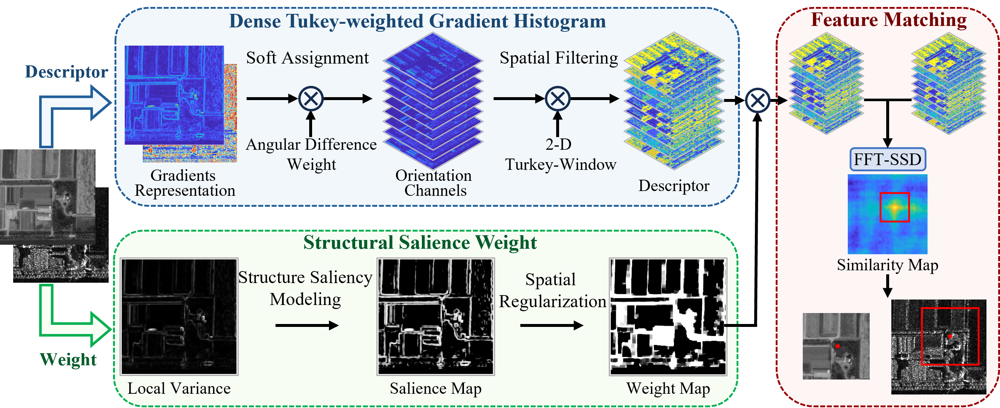
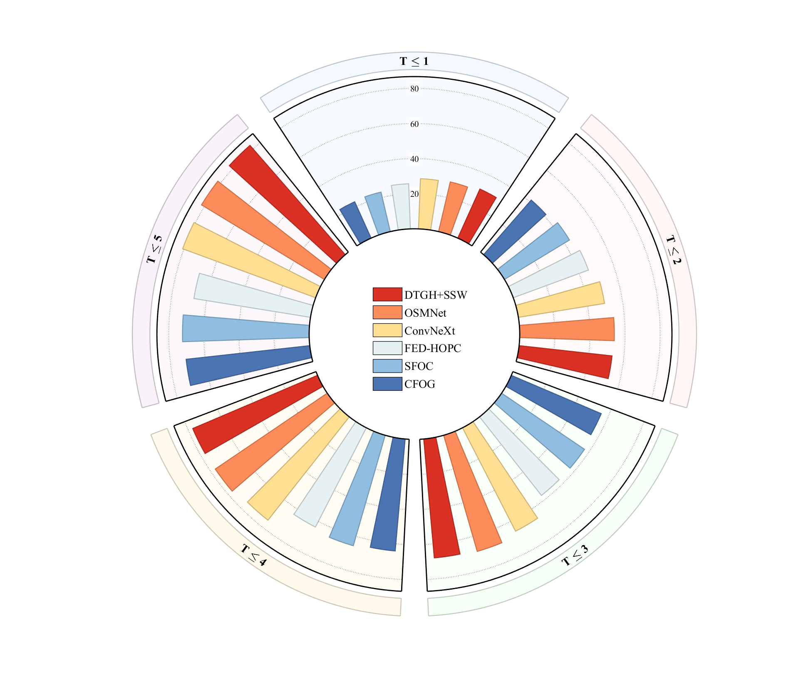
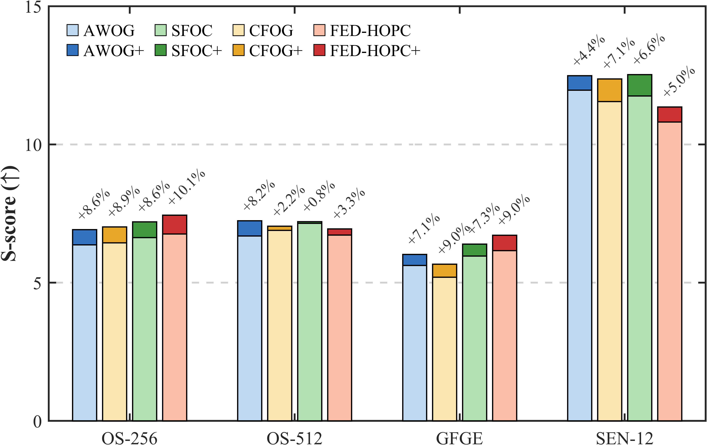

# DTGH-SSW

## Robust Optical-to-SAR Image Registration via Dense Tukey-Weighted Gradient Histogram and Structural Saliency Weight

**Semi-open-source MATLAB implementation of DTGH-SSW, an area-based optical-to-SAR image matching framework.**

本项目提供 DTGH-SSW 的半开源 MATLAB 实现。DTGH-SSW 是一种基于区域的光学-SAR 图像匹配框架。

> The source code and experimental data are being organized and standardized. The repository will be updated after the corresponding paper is officially published.
>
> 相关代码与实验数据正在整理和规范化中，并将在论文正式发表后持续更新。

---

## Paper Information / 论文信息

**Title / 题目**

Robust Optical-to-SAR Image Registration via Dense Tukey-Weighted Gradient Histogram and Structural Saliency Weight

**Authors / 作者**

Wenhao Tong, Anxi Yu, Huatao Yu, Chenshuo Ma, Ziyu Yan, and Zhen Dong

**Journal / 期刊**

*IEEE Journal of Selected Topics in Applied Earth Observations and Remote Sensing (J-STARS)*

**Status / 状态**

Accepted for publication; not yet formally published.

论文已被接收，尚未正式出版。

**Overview / 简介**

This work presents a robust area-based optical-to-SAR image registration framework that integrates a Dense Tukey-Weighted Gradient Histogram (DTGH) descriptor with a Structural Saliency Weight (SSW) mechanism.

本研究提出了一种鲁棒的光学-SAR 图像配准框架，通过结合密集 Tukey 加权梯度直方图（DTGH）描述子与结构显著性权重（SSW）机制，实现复杂条件下的跨模态图像匹配。

---

## Method Overview / 方法概览

<p align="center">
  
</p>

<p align="center">
  <em>Overall workflow of the proposed DTGH-SSW method / DTGH-SSW 方法总体流程</em>
</p>

The proposed framework contains three main stages:

1. **Dense Tukey-Weighted Gradient Histogram (DTGH):** soft orientation assignment and spatial filtering with a two-dimensional Tukey window produce a dense and robust cross-modal descriptor.
2. **Structural Saliency Weight (SSW):** local structural saliency is modelled and spatially regularized to emphasize informative regions while suppressing unstable responses.
3. **FFT-based matching:** the weighted descriptors are matched efficiently in the frequency domain to generate a similarity map and estimate the registration position.

所提框架主要包括三个阶段：

1. **密集 Tukey 加权梯度直方图（DTGH）：** 通过方向软分配与二维 Tukey 窗空间滤波，构建稠密、鲁棒的跨模态描述子。
2. **结构显著性权重（SSW）：** 对局部结构显著性进行建模和空间正则化，突出信息丰富区域并抑制不稳定响应。
3. **基于 FFT 的匹配：** 在频域中高效匹配加权描述子，生成相似性图并估计配准位置。

---

## Experimental Highlights / 实验结果亮点

### Comparison with Representative Methods / 与代表性方法对比

<p align="center">
  
</p>

<p align="center">
  <em>Performance comparison under different registration-error thresholds / 不同配准误差阈值下的性能对比</em>
</p>

The circular bar chart compares DTGH+SSW with representative handcrafted and learning-based methods under increasingly relaxed error thresholds. DTGH+SSW maintains strong and stable matching performance across the evaluated threshold range.

环形柱状图展示了 DTGH+SSW 与多种代表性手工方法及学习方法在不同配准误差阈值下的对比结果。DTGH+SSW 在所评估的阈值范围内保持了较强且稳定的匹配性能。

### Effectiveness of the SSW Module / SSW 模块有效性

<p align="center">
  
</p>

<p align="center">
  <em>S-score improvements obtained by integrating SSW into existing descriptors / 将 SSW 集成到现有描述子后的 S-score 提升</em>
</p>

Integrating SSW improves the S-score of AWOG, SFOC, CFOG, and FED-HOPC across the OS-256, OS-512, GFGE, and SEN-12 datasets. These results indicate that SSW is not limited to DTGH and can serve as a transferable weighting strategy for different area-based descriptors.

在 OS-256、OS-512、GFGE 和 SEN-12 数据集上，将 SSW 分别集成至 AWOG、SFOC、CFOG 和 FED-HOPC 后均获得了 S-score 提升。该结果表明，SSW 并不局限于 DTGH，还可作为一种具有可迁移性的加权策略应用于不同的区域描述子。

---

## Semi-Open-Source Statement / 半开源声明

To protect the intellectual property of the proposed method while supporting reproducible evaluation, the core computational modules are distributed as precompiled MEX binaries generated with MATLAB Coder.

为保护所提方法的核心知识产权，同时支持实验验证与结果复现，本项目将核心计算模块以 MATLAB Coder 生成的预编译 MEX 二进制文件形式发布。

### Open Components / 开放部分

The following components are fully open-source:

- Data loading and preprocessing
- Result visualization
- Evaluation and demonstration scripts

以下内容完全开源：

- 数据读取与预处理
- 结果可视化
- 实验演示与评价程序

### Core Module / 核心模块

The core algorithm is encapsulated in:

```text
DTGH_SSW_mex.mexw64
```

The binary module provides the complete matching functionality without directly exposing the underlying implementation.

核心算法封装于上述二进制模块中。该模块提供完整的匹配功能，但不直接公开底层实现。

---

## System Requirements / 系统要求

- MATLAB R2021b or later / MATLAB R2021b 或更高版本
- Windows 64-bit / Windows 64 位操作系统

---

## Quick Start / 快速开始

### 1. Clone the repository / 克隆仓库

```bash
git clone https://github.com/TweepingH/DTGH_SSW.git
cd DTGH_SSW
```

### 2. Open the project in MATLAB / 在 MATLAB 中打开项目

Launch MATLAB and set the current folder to the project directory.

启动 MATLAB，并将当前工作目录切换至本项目文件夹。

### 3. Run the demo / 运行演示程序

```matlab
demo
```

The demo covers the following workflow:

1. Block-wise Harris feature point detection
2. DTGH descriptor extraction
3. SSW (Structural Saliency Weight)
4. FFT-based feature matching
5. Registration error evaluation
6. Matching-result visualization

演示程序包含以下流程：

1. 分块 Harris 特征点提取
2. DTGH 特征描述子构建
3. SSW 结构显著性权重
4. 基于 FFT 的特征匹配
5. 配准误差计算
6. 匹配结果可视化

The algorithm parameters follow the configuration used in Experiment II of the corresponding paper.

算法参数设置遵循对应论文实验二（Experiment II）中的配置。

---

## Repository Structure / 仓库结构

```text
DTGH_SSW/
├── demo.m
├── matchFrame.mexw64
├── Checkerboard.m
├── ErrorDet.m
├── OSEval_Uint8/
├── assets/
│   ├── method_overview.png
│   ├── multi_method_comparison.png
│   └── ssw_module_improvements.png
└── README.md
```

The final directory structure may be adjusted when the complete release is published.

完整版本发布时，目录结构可能根据实际内容进行调整。

---

## Contact / 联系方式

For academic inquiries, algorithm-related questions, or research collaboration, please contact:

如对本文算法、代码或相关研究合作感兴趣，请联系：

```text
twh10355@nudt.edu.cn
```

---

## Citation / 引用

If you use this code in your research, please cite the corresponding paper.

如果您在研究中使用本代码，请引用对应论文。

```bibtex
@article{Tong2026DTGHSSW,
  title   = {Robust Optical-to-SAR Image Registration via Dense Tukey-Weighted Gradient Histogram and Structural Saliency Weight},
  author  = {Tong, Wenhao and Yu, Anxi and Yu, Huatao and Ma, Chenshuo and Yan, Ziyu and Dong, Zhen},
  journal = {IEEE Journal of Selected Topics in Applied Earth Observations and Remote Sensing},
  year    = {2026},
  note    = {Accepted for publication}
}
```

---

## License and Usage / 许可与使用

The open-source components and the precompiled core module may be subject to different usage terms. Please refer to the license file included in the official release.

开放源代码部分与预编译核心模块可能适用不同的使用条款，请以正式发布版本中的许可文件为准。
